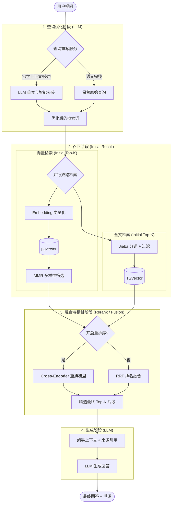

# J-RAG: Java 企业级检索增强生成引擎


**J-RAG** 是一个基于 **Spring Boot** 和 **LangChain4j** 构建的稳健全栈 RAG 系统。它将您的私有数据与大语言模型 (LLM) 连接起来，提供精准且具备上下文感知能力的智能问答。

---

## 🌟 核心特性

- **🔐 安全认证**: 完整的用户注册与登录流程，采用 JWT 进行安全保护。
- **📄 智能文档摄取**:
    - **多格式支持**: 深度支持 **PDF**, **Word**, **Excel**, **Markdown**, **TXT** 等格式。
    - **格式感知切分**: 针对不同文档类型采用特定的切分策略（例如 Markdown 标题层级、PDF 视觉元素识别）。
    - **视觉能力**: 集成视觉模型 (Vision LLM)，支持对扫描版 PDF 进行 OCR 识别以及对图表进行语义分析。
- **🧠 高级 RAG 引擎**:
    - **混合检索 (Hybrid Search)**: 结合 **向量检索** (语义匹配) 与 **关键词检索** (精确匹配)。
    - **结果重排 (Re-ranking)**: 引入 RRF (倒数排名融合) 与 MMR (最大边界相关性) 算法，确保结果的准确性与多样性。
    - **来源溯源**: 每条回答均精准标注原文引用出处，支持点击跳转。
- **💬 实时交互**:
    - 基于 **WebSocket** 的实时流式对话体验。
    - 完整的会话历史管理。

---

## 🛠️ 技术栈

- **后端**: Java 21, Spring Boot 3
- **AI 集成**: LangChain4j (兼容 OpenAI API 协议)
- **数据库**: PostgreSQL + pgvector 扩展
- **安全**: Spring Security + JWT
- **文档处理**: Apache PDFBox, Apache POI, Tabula
- **前端**: React 19, TypeScript, Vite, Tailwind CSS (位于 `frontend/` 目录)

---

## 🚀 快速开始

### 1. 环境准备
- **Java 21+**: 确保安装了 JDK 21 或更高版本。
- **Maven**: 用于构建后端。
- **Node.js**: 用于构建前端。
- **PostgreSQL**: 需要安装并启用 `vector` 扩展。

### 2. 启动数据库
请确保你有一个可用的 PostgreSQL 数据库。
1.  创建一个名为 `qarag` (或其他名称) 的数据库。
2.  **关键步骤**：在数据库中执行以下 SQL 命令以启用向量扩展：
    ```sql
    CREATE EXTENSION IF NOT EXISTS vector;
    ```

### 3. 系统配置
你需要配置大模型 API、数据库连接以及 JWT 密钥。
推荐在项目根目录创建环境变量，或者直接修改 `src/main/resources/application.properties`。

#### 核心配置项
| 配置项 | 环境变量 | 说明 |
|--------|----------|------|
| **LLM (聊天)** | `CHAT_MODEL_API_KEY` | **必填**。聊天模型的 API Key。 |
| | `CHAT_MODEL_BASE_URL` | 模型厂商的 Base URL (如阿里云、DeepSeek)。 |
| | `CHAT_MODEL_NAME` | 模型名称 (如 `qwen-max`, `gpt-4o`)。 |
| **Embedding (向量)** | `EMBEDDING_MODEL_API_KEY` | **必填**。向量模型的 API Key。 |
| | `EMBEDDING_MODEL_BASE_URL` | 向量模型 Base URL。 |
| **Vision (视觉)** | `VISION_API_KEY` | 选填。用于 OCR 和图片理解。 |
| | `VISION_BASE_URL` | 视觉模型 Base URL。 |
| **数据库** | `DB_URL` | JDBC 连接地址 (如 `jdbc:postgresql://localhost:5432/qarag`)。 |
| | `DB_USERNAME` | 数据库用户名。 |
| | `DB_PASSWORD` | 数据库密码。 |
| **安全** | `JWT_SECRET` | **必填**。生成 Token 的密钥 (建议 32 位以上随机字符串)。 |

#### RAG 参数调优
| 配置项 | 默认值 | 说明 |
|--------|--------|------|
| `app.rag.retrieval.top-k` | 5 | 每次检索召回的片段数量。 |
| `app.rag.chunking.size` | 1000 | 文档切分的最大字符数。 |
| `app.rag.chunking.overlap` | 300 | 切分块之间的重叠字符数。 |

### 4. 运行后端
使用 Maven 启动 Spring Boot 应用：
```bash
mvn spring-boot:run
```
- 服务将在 `http://localhost:8080` 启动。
- Flyway 会自动执行数据库迁移脚本，建立表结构。

### 5. 运行前端
进入前端目录并启动开发服务器：
```bash
cd frontend
npm install
npm run dev
```
- 前端将在 `http://localhost:5173` 启动。
- 确保在前端目录下配置 `.env` (如果需要) 或依赖 Vite 代理连接后端。

---

## 🏗️ 架构设计

### 🔍 混合检索与查询优化流程



J-RAG 采用了一套精密的检索管道 (Retrieval Pipeline)，确保系统能够理解复杂的对话上下文并从海量文档中精准定位信息：

1.  **查询重写与智能去噪 (Query Rewrite & Denoise)**
    - **上下文补全**：利用 LLM 分析最近 $N$ 轮对话历史，将用户模糊的提问（如“它的原理是什么？”）改写为独立完整的语义查询。
    - **搜索去噪**：LLM 自动剔除“我想知道”、“麻烦分析一下”等对检索无意义的噪声词，仅保留核心检索关键词，大幅提升全文检索的精确度。

2.  **并行双路搜索 (Parallel Dual-Path Search)**
    - **语义向量搜索 (Vector Search)**：将查询转换为高维向量，利用 `pgvector` 计算余弦相似度。这负责捕获“意思相近但词语不同”的相关内容。
    - **关键词全文检索 (Keyword Search)**：利用 PostgreSQL 的 TSVector 功能进行倒排索引查找。
        - **分词增强**：系统在检索前使用 `Jieba` 对查询进行精细分词，并过滤自定义停用词。
        - **索引模式**：使用 `websearch_to_tsquery` 以支持类似 Google 的自然语言检索语法。

3.  **重排序与结果精选 (Re-ranking & Selection)**

    - **两阶段漏斗模型**：系统首先从双路搜索中获取较多数量的候选片段（由 `initial-top-k` 配置，如 20-50 个），确保不遗漏潜在答案。

    - **高精度重排**：如果开启重排序，系统将调用专用的 Cross-Encoder 模型对这数十个候选片段进行深度语义匹配打分，最后仅精选出最相关的 Top-K 个（由 `top-k` 配置，如 5 个）返回给用户。

    - **逻辑互斥**：开启重排序后将自动替代 RRF 算法，以获得更高的语义匹配精度。


4.  **生成回答 (Augmented Generation)**
    - 将优化后的上下文片段送入 LLM，要求模型严格基于背景知识回答，并在回答中通过 `[文件名:页码]` 形式标注引用来源。

> **💡 提示：全文检索不到结果？**
> 在中文环境下，全文检索依赖于正确的索引分词。如果您的全文检索在显示“找到结果”但结果不相关，请检查数据库中的 `content_search` 字段是否在入库时进行了正确的预分词处理。本项目默认使用 `simple` 配置配合 `Jieba` 预处理，若检索不理想，可考虑在数据库层面集成 `zhparser` 插件。

### 文档切分策略 (Dual-Layer Chunking)
J-RAG 采用**双层策略模式**来实现高质量的文档摄取：

1.  **第一层：文件类型策略**
    - `MarkdownChunker`: 基于标题层级 (#, ##) 进行语义切分。
    - `PdfChunker`: 专为 PDF 设计的复杂处理流程。
    - `WordChunker` / `ExcelChunker`: 针对 Office 文档的结构化解析。
    - `RecursiveChunker`: 针对普通文本的递归切分兜底策略。

2.  **第二层：PDF 元素策略 (嵌套)**
    - 在 `PdfChunker` 内部，根据页面内容动态选择处理器：
    - `ScannedPageProcessor`: 调用 Vision LLM 对扫描件进行 OCR。
    - `TableProcessor`: 使用 Tabula 提取表格并转换为 Markdown 格式。
    - `ImageProcessor`: 调用 Vision LLM 对图表/图片进行语义理解。
    - `TextProcessor`: 标准文本提取。

---

## 📅 路线图 (Roadmap)

### 🚀 核心 RAG 优化
- [x] **重排序 (Re-ranking)**: 引入两阶段检索 (Retrieve -> Rerank)，利用 `bge-reranker` 等模型对 Top-K 结果进行精细排序，大幅提升准确率。
- [x] **上下文查询重写 (Query Rewriting)**: 利用 LLM 改写用户查询，解决多轮对话中的指代消解和意图模糊问题。
- [ ] **图谱增强 RAG (Graph RAG)**: 构建知识图谱 (Knowledge Graph)，支持多跳推理和复杂实体关系查询。

### 📄 数据摄取增强
- [ ] **PPT 解析**: 支持 `.pptx` 幻灯片内容提取。
- [ ] **跨页表格处理**: 优化 PDF 解析，智能合并跨页表格。
- [ ] **网页抓取**: 支持直接输入 URL 进行网页内容摄取。

### 🛠️ 系统功能
- [ ] **管理仪表板**: 可视化向量库状态，支持人工修正切分块，查看聊天日志。

---

## 📄 开源协议

本项目采用 **Apache License 2.0** 许可证。详情请参阅 [LICENSE](LICENSE.md) 文件。

---

_Built with ❤️ by [TwoCold](https://github.com/twocold0451)_
