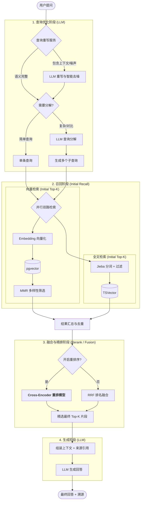

# J-RAG: Java 企业级检索增强生成引擎


**J-RAG** 是一个基于 **Spring Boot** 和 **LangChain4j** 构建的稳健全栈 RAG 系统。它将您的私有数据与大语言模型 (LLM) 连接起来，提供精准且具备上下文感知能力的智能问答。

**🌐 演示地址**: [https://jrag.zeabur.app/](https://jrag.zeabur.app/)

---

## 🚀 快速开始 (Docker Compose)

### 1. 准备环境配置
在项目根目录创建 `.env` 文件，并根据你的模型供应商（如阿里云、DeepSeek、SiliconFlow 等）填写配置：

```bash
# 复制模板
cp .env.example .env
# 编辑配置
nano .env
```

**.env 配置模板 (包含可选功能)：**
```env
# --- 基础配置 (必填) ---
# 数据库 (Docker 内部自动连接)
# 注意：已启用 Schema 隔离 (jrag_core)
DB_URL=jdbc:postgresql://db:5432/jrag?currentSchema=jrag_core
DB_USERNAME=postgres
DB_PASSWORD=postgres

# LLM 聊天模型 (OpenAI 协议)
CHAT_MODEL_API_KEY=
CHAT_MODEL_BASE_URL=
CHAT_MODEL_NAME=

# Embedding 向量模型
EMBEDDING_MODEL_API_KEY=
EMBEDDING_MODEL_BASE_URL=
EMBEDDING_MODEL_NAME=

# 安全配置 (建议 32 位以上随机字符串)
JWT_SECRET=your_custom_long_secret_string

# --- 高级功能 (可选) ---
# Rerank 重排 (提升检索精度)
RERANK_ENABLED=true
RERANK_API_KEY=
RERANK_BASE_URL=
RERANK_MODEL_NAME=

# Vision 视觉 (用于 OCR 和图片理解)
VISION_ENABLED=true
VISION_API_KEY=
VISION_BASE_URL=
VISION_MODEL_NAME=

# LangFuse 可观测性 (追踪调用链路)
LANGFUSE_ENABLED=true
LANGFUSE_PUBLIC_KEY=
LANGFUSE_SECRET_KEY=
LANGFUSE_BASE_URL=
```

### 2. 一键启动
确保你已安装 Docker 和 Docker Compose，然后在根目录执行：

```bash
docker-compose up -d --build
```

> **⚠️ 注意事项**:
> *   容器首次启动时会自动创建名为 `jrag` 的数据库。
> *   如果你之前运行过本项目（或存在旧的 `postgres-data` 目录），可能会因为旧数据冲突导致数据库创建失败。此时请先删除项目根目录下的 `postgres-data` 文件夹，再重新启动。

### 3. 访问系统
- **前端界面**: `http://localhost:5173`
- **后端 API**: `http://localhost:8080`
- **数据库**: `localhost:5432` (jrag)

### 4. 默认管理员账号
系统在首次启动时会通过 Flyway 自动初始化一个管理员账号：
- **用户名**: `admin`
- **密码**: `XHy@azy5Mhy2`
- **建议**: 登录后请立即进入“用户管理”或“设置”页面修改默认密码。

---

## 🌟 核心特性

- **🔐 安全认证**: 完整的用户注册与登录流程，采用 JWT 进行安全保护。
    - **👥 用户与权限管理**:
        - **用户分组**: 支持创建不同的用户组 (如 "研发部", "市场部")，方便人员管理。
        - **资源隔离**: 基于组的资源访问控制 (RBAC)，精确控制不同用户组可见的对话模板和知识库范围。
        - **管理员后台**: 提供可视化的用户管理、分组管理和密码重置功能。
- **📝 对话模板 (Conversation Templates)**:
    - **场景预设**: 管理员可创建特定主题的对话模板 (如 "HR 助手", "技术支持")，预置提示词和参数。
    - **知识库绑定**: 模板可绑定特定的文档集合，实现知识隔离，确保问答仅基于相关领域知识。
    - **灵活分发**: 支持将模板设置为“全员可见”或仅对“特定用户组可见”。
- **📄 智能文档摄取**:
    - **多格式支持**: 深度支持 **PDF**, **Word**, **PPTX**, **Excel**, **Markdown**, **TXT** 等格式。
    - **网页抓取**: 支持直接从 **URL** 抓取内容，自动提取正文并转换为 Markdown 格式进行摄取。
    - **格式感知切分**: 针对不同文档类型采用特定的切分策略（例如 Markdown 标题层级、PPT 幻灯片维度、PDF 视觉元素识别）。
    - **视觉能力**: 集成视觉模型 (Vision LLM)，支持对扫描版 PDF 进行 OCR 识别以及对图表进行语义分析。
- **🧠 高级 RAG 引擎**:
    - **混合检索 (Hybrid Search)**: 结合 **向量检索** (语义匹配) 与 **关键词检索** (精确匹配)。
    - **查询增强**:
        - **上下文重写**: 自动补全对话背景，消除指代不明。
        - **复杂查询分解**: 将对比、多步推理等复杂问题智能拆解为多个子查询，并行检索以获得更全面的上下文。
        - **ReAct Agent (深度思考模式)**: 基于 **ReAct (Reasoning + Acting)** 范式构建的 Agent。针对极度复杂的问题，LLM 能够自主规划、调用工具（检索/分解）、观察结果并自我反思，直到收集到足够信息才给出最终答案。
    - **结果重排 (Re-ranking)**: 引入 RRF (倒数排名融合) 与 MMR (最大边界相关性) 算法，确保结果的准确性与多样性。
    - **来源溯源**: 每条回答均精准标注原文引用出处，支持点击跳转。
- **📊 全链路可观测性**:
    - **LangFuse 集成**: 自动追踪 RAG 链路的每一步（Query Rewrite, Retrieval, LLM Generation）。
    - **精细化控制**: 提供自定义注解 `@Observed`，支持字段过滤、参数脱敏和集合截断，避免敏感数据泄露和日志爆炸。
- **💬 实时交互**:
    - 基于 **WebSocket** 的实时流式对话体验。
    - 完整的会话历史管理。

---

## 🛠️ 技术栈

- **后端**: Java 21, Spring Boot 3
- **AI 集成**: LangChain4j (兼容 OpenAI API 协议)
- **数据库**: PostgreSQL + pgvector 扩展
- **安全**: Spring Security + JWT
- **文档处理**: Apache PDFBox, Apache POI, Tabula
- **前端**: React 18, TypeScript, Vite, Tailwind CSS (位于 `frontend/` 目录)

---

## 🛠️ 本地开发环境搭建 (手动)

如果你需要进行代码调试或二次开发，请按以下步骤操作。

### 1. 环境准备
- **Java 21+**, **Maven**, **Node.js**.
- **PostgreSQL**: 安装并启用 `vector` 扩展：
    ```sql
    CREATE EXTENSION IF NOT EXISTS vector;
    ```

### 2. 系统配置
参照根目录下的 `.env.example` 文件，配置你的环境变量。
- **后端**: 修改 `src/main/resources/application.properties` 或设置系统环境变量。
- **前端**: 在 `frontend/` 目录下根据需要配置 `.env`。

### 3. 运行项目
**运行后端**:
```bash
mvn spring-boot:run
```
**运行前端**:
```bash
cd frontend && npm install && npm run dev
```

---

## 📊 RAG 质量评估

`evaluation` 目录包含了用于评估 RAG 管道性能的脚本，目前主要使用 [Ragas](https://github.com/explodinggradients/ragas) 框架。

### 1. 配置评估环境

在 `evaluation/` 目录下，复制并编辑配置文件：

```bash
cp evaluation/config.yaml.example evaluation/config.yaml
nano evaluation/config.yaml
```

**`config.yaml` 关键配置项:**

-   `database`: 配置用于评估的数据库连接信息。
-   `openai`: 配置用于“裁判”的 LLM (LLM-as-a-Judge) 的 API 信息。推荐使用 GPT-4 级别模型以保证评估的准确性。
-   `sampling`: 配置每次评估时从 `rag_interactions` 表中抽取的样本数量等。

### 2. 安装依赖

```bash
pip install -r evaluation/requirements.txt
```

### 3. 运行评估脚本

目前提供 `faithfulness` 指标的评估，它用来衡量模型的回答是否忠实于检索到的上下文。

```bash
python evaluation/evaluate_faithfulness.py
```

脚本会自动连接数据库，抽取最新的问答记录，使用配置的 LLM 进行打分，并将详细结果保存在 `evaluation/evaluation_results.csv` 文件中。

---

## 🏗️ 架构设计

### 🔍 混合检索与查询优化流程


```mermaid
graph TD
    User([用户提问]) --> Rewrite{查询重写服务}
    
    subgraph "1. 查询优化阶段 (LLM)"
        Rewrite -- 包含上下文/噪声 --> LLM_Rewrite[LLM 重写与智能去噪]
        Rewrite -- 语义完整 --> Decompose_Check{需要分解?}
        LLM_Rewrite --> Decompose_Check
        
        Decompose_Check -- 简单查询 --> Single_Query[单条查询]
        Decompose_Check -- 复杂/对比 --> Decompose[LLM 查询分解]
        Decompose --> Sub_Queries[生成多个子查询]
    end

    Single_Query --> Search_Parallel{并行双路检索}
    Sub_Queries --> Search_Parallel

    subgraph "2. 召回阶段 (Initial Recall)"
        subgraph "向量检索 (Initial Top-K)"
            Search_Parallel --> Embedding[Embedding 向量化]
            Embedding --> Vector_DB[(pgvector)]
            Vector_DB --> MMR[MMR 多样性筛选]
        end

        subgraph "全文检索 (Initial Top-K)"
            Search_Parallel --> Jieba[Jieba 分词 + 过滤]
            Jieba --> FTS_DB[(TSVector)]
        end
    end
    
    MMR --> Merge[结果汇总与去重]
    FTS_DB --> Merge
    Merge --> Decision{开启重排序?}

    subgraph "3. 融合与精排阶段 (Rerank / Fusion)"
        Decision -- 是 --> Rerank[<b>Cross-Encoder 重排模型</b>]
        Decision -- 否 --> RRF[RRF 排名融合]
        Rerank --> Top_K[精选最终 Top-K 片段]
        RRF --> Top_K
    end

    subgraph "4. 生成阶段 (LLM)"
        Top_K --> Context[组装上下文 + 来源引用]
        Context --> LLM_Gen[LLM 生成回答]
    end

    LLM_Gen --> Final_Response([最终回答 + 溯源])
```

J-RAG 采用了一套精密的检索管道 (Retrieval Pipeline)，确保系统能够理解复杂的对话上下文并从海量文档中精准定位信息：

1.  **查询重写与智能去噪 (Query Rewrite & Denoise)**
    - **上下文补全**：利用 LLM 分析最近 $N$ 轮对话历史，将用户模糊的提问（如“它的原理是什么？”）改写为独立完整的语义查询。
    - **搜索去噪**：LLM 自动剔除“我想知道”、“麻烦分析一下”等对检索无意义的噪声词，仅保留核心检索关键词，大幅提升全文检索的精确度。
    - **查询分解 (Query Decomposition)**：对于“对比A和B”或“如何做X以及它的好处”等复杂问题，LLM 将其拆解为多个独立的事实检索子查询（如“A的特征”、“B的特征”），并行执行搜索。这显著提高了对复杂逻辑问题的回答质量，避免单次搜索丢失信息。

2.  **并行双路搜索 (Parallel Dual-Path Search)**
    - **语义向量搜索 (Vector Search)**：将查询转换为高维向量，利用 `pgvector` 计算余弦相似度。这负责捕获“意思相近但词语不同”的相关内容。
    - **关键词全文检索 (Keyword Search)**：利用 PostgreSQL 的 TSVector 功能进行倒排索引查找。
        - **分词增强**：系统在检索前使用 `Jieba` 对查询进行精细分词，并过滤自定义停用词。
        - **索引模式**：使用 `websearch_to_tsquery` 以支持类似 Google 的自然语言检索语法。

3.  **重排序与结果精选 (Re-ranking & Selection)**

    - **两阶段漏斗模型**：系统首先从双路搜索中获取较多数量的候选片段（由 `initial-top-k` 配置，如 20-50 个），确保不遗漏潜在答案。

    - **高精度重排**：如果开启重排序，系统将调用专用的 Cross-Encoder 模型对这数十个候选片段进行深度语义匹配打分，最后仅精选出最相关的 Top-K 个（由 `top-k` 配置，如 5 个）返回给用户。

    - **逻辑互斥**：开启重排序后将自动替代 RRF 算法，以获得更高的语义匹配精度。


4.  **生成回答 (Augmented Generation)**
    - 将优化后的上下文片段送入 LLM，要求模型严格基于背景知识回答，并在回答中通过 `[文件名:页码]` 形式标注引用来源。

> **💡 提示：全文检索不到结果？**
> 在中文环境下，全文检索依赖于正确的索引分词。如果您的全文检索在显示“找到结果”但结果不相关，请检查数据库中的 `content_search` 字段是否在入库时进行了正确的预分词处理。本项目默认使用 `simple` 配置配合 `Jieba` 预处理，若检索不理想，可考虑在数据库层面集成 `zhparser` 插件。

### 文档切分策略 (Dual-Layer Chunking)
J-RAG 采用**双层策略模式**来实现高质量的文档摄取：

1.  **第一层：文件类型策略**
    - `MarkdownChunker`: 基于标题层级 (#, ##) 进行语义切分。
    - `PdfChunker`: 专为 PDF 设计的复杂处理流程。
    - `WordChunker` / `ExcelChunker`: 针对 Office 文档的结构化解析。
    - `RecursiveChunker`: 针对普通文本的递归切分兜底策略。

2.  **第二层：PDF 元素策略 (嵌套)**
    - 在 `PdfChunker` 内部，根据页面内容动态选择处理器：
    - `ScannedPageProcessor`: 调用 Vision LLM 对扫描件进行 OCR。
    - `TableProcessor`: 使用 Tabula 提取表格并转换为 Markdown 格式。
    - `ImageProcessor`: 调用 Vision LLM 对图表/图片进行语义理解。
    - `TextProcessor`: 标准文本提取。

---

## 📅 路线图 (Roadmap)

### 🚀 核心 RAG 优化
- [x] **重排序 (Re-ranking)**: 引入两阶段检索 (Retrieve -> Rerank)，适配 **Jina Reranker**、BGE 等模型，大幅提升 Top-K 检索准确率。
- [x] **上下文查询重写 (Query Rewriting)**: 利用 LLM 改写用户查询，解决多轮对话中的指代消解和意图模糊问题。
- [x] **复杂查询分解**: 实现子查询拆解与并行检索，支持对比和多步问题。
- [x] **Agentic RAG (深度思考)**: 实现基于 ReAct 范式的智能体，支持自主工具调用与多步推理。
- [ ] **图谱增强 RAG (Graph RAG)**: 构建知识图谱 (Knowledge Graph)，支持多跳推理和复杂实体关系查询。

### 📄 数据摄取增强
- [ ] **跨页表格处理**: 优化 PDF 解析，智能合并跨页表格。
- [x] **文本清洗与噪音过滤**: 优化解析逻辑，自动过滤多余空格、重复换行及无效符号，提升数据纯净度。

### 🧠 Jina AI 深度优化
- [ ] **全栈集成**: 统一接入 **Jina Reader** (抓取)、**Embeddings v3** (向量化) 和 **Reranker** (重排)。
- [ ] **Late Chunking**: 实现服务端后期分块技术，使分块向量具备全局上下文感知能力。
- [ ] **统一嵌入工厂**: 实现 Embedding Provider 总开关，支持根据任务意图 (Ingestion/Query) 自动切换 Jina 的 `task` 参数，确保向量空间一致性。
- [ ] **长上下文策略**: 调整 Chunk Size (800-1200 Token) 以充分利用 Jina v3 的长窗口优势。

### 🛠️ 系统功能
- [x] **全链路可观测性 (Observability)**: 集成 LangFuse 追踪链路延迟、Token 消耗及检索质量。
- [x] **后台管理系统**: 前端重构，支持用户管理、分组管理、对话模板配置及权限关联。
- [ ] **管理仪表板**: 可视化向量库状态，支持人工修正切分块，查看聊天日志。

### 📊评估与质量保障
- [ ] **建立 RAG 评估三元组 (RAG Triad)**
    - **Context Relevance**: 评估检索内容与问题的相关性。
    - **Faithfulness / Groundedness**: 评估回答是否忠实于检索到的上下文（防止幻觉）。
    - **Answer Relevance**: 评估回答是否直接解决了用户的问题。
- [ ] **集成 Langfuse 自动评分 (LLM-as-a-Judge)**
    - 在 Langfuse 后台配置基于模板的自动评估任务。
    - 利用 GPT-4o 作为裁判，对生产环境的真实对话进行持续打分。
- [ ] **引入 Ragas 专业指标 (离线评估)**
    - 编写评估脚本，计算 Context Precision, Context Recall 等深度指标。
    - 定期跑测以监控系统迭代带来的质量波动。
- [ ] **构建“黄金数据集” (Golden Dataset)**
    - 整理 50+ 典型问答对作为 Benchmark。
    - 实现自动化回归测试，确保功能优化不导致质量倒退。
---

## 📄 开源协议

本项目采用 **Apache License 2.0** 许可证。详情请参阅 [LICENSE](LICENSE.md) 文件。

---

_Built with ❤️ by [twocold0451](https://github.com/twocold0451)_